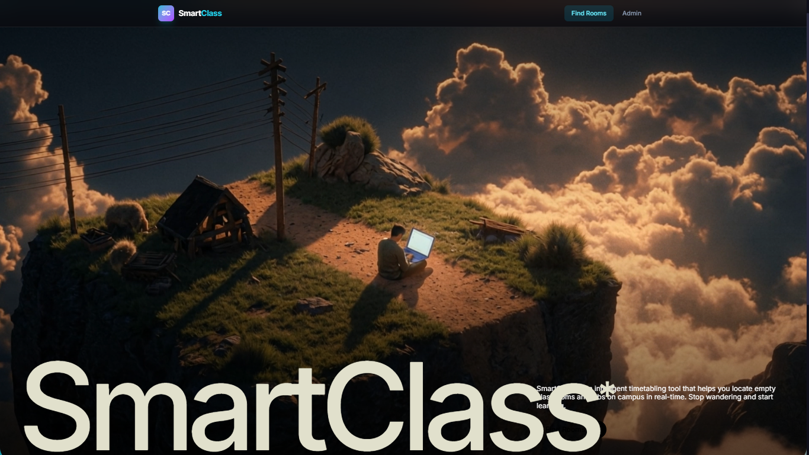
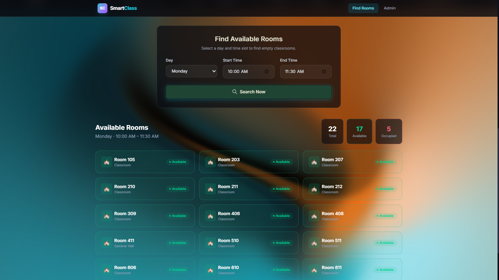
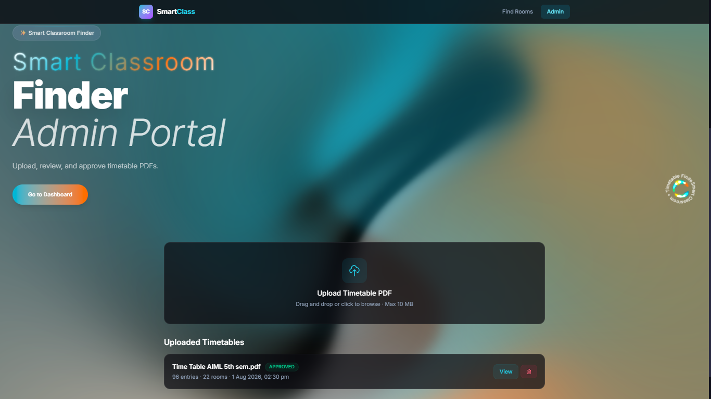
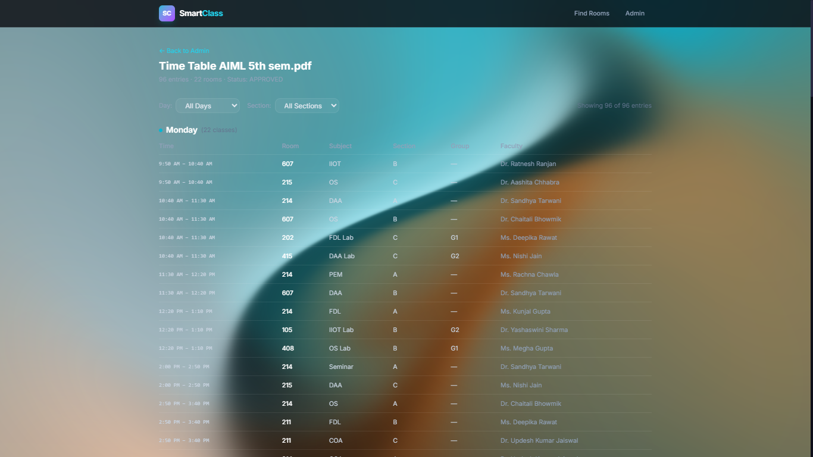
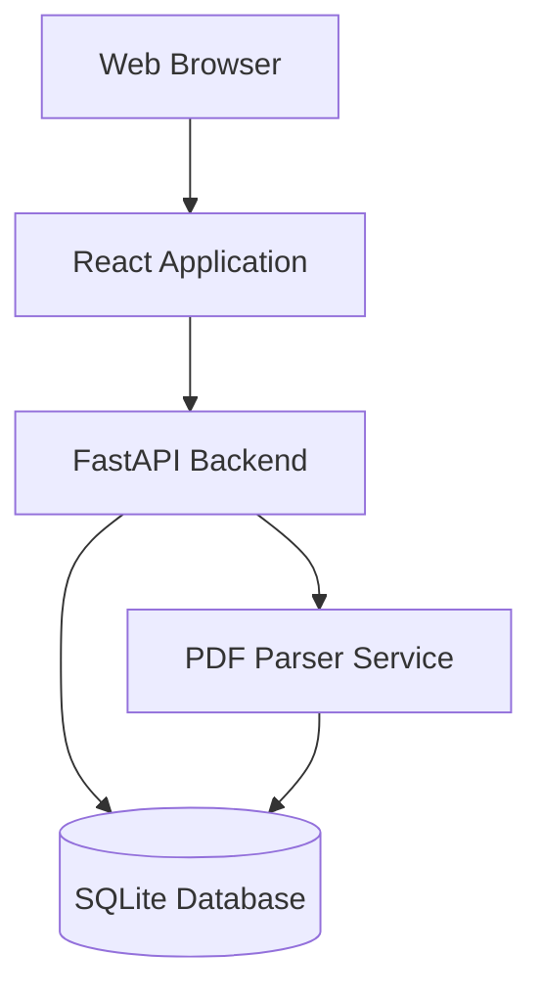
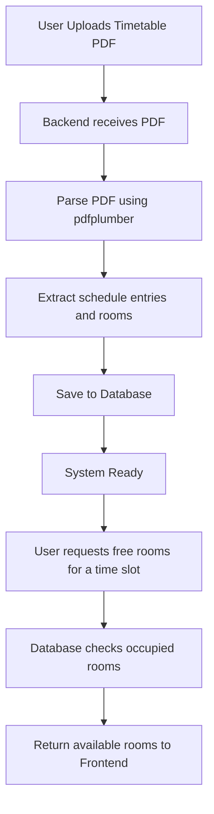

# Smart Classroom Finder

Find available free rooms in your college based on the timetable and time slot you provide.

## Live Demo

[Live Demo Link](#)

## Screenshots

### Landing Page

### Find Available Rooms

### Admin Portal

### Timetable View

## System Architecture

## System Workflow

## Technologies Used

* Frontend
  * React
  * TypeScript
  * Vite
  * Tailwind CSS
* Backend
  * FastAPI
  * Python
  * SQLAlchemy
  * pdfplumber

## Setup Instructions

### Backend Setup

1. Open a terminal and navigate to the backend directory
2. Create a virtual environment
3. Install the required dependencies from the requirements file
4. Start the FastAPI development server

### Frontend Setup

1. Open a terminal and navigate to the frontend directory
2. Install the required dependencies using your package manager
3. Start the development server
